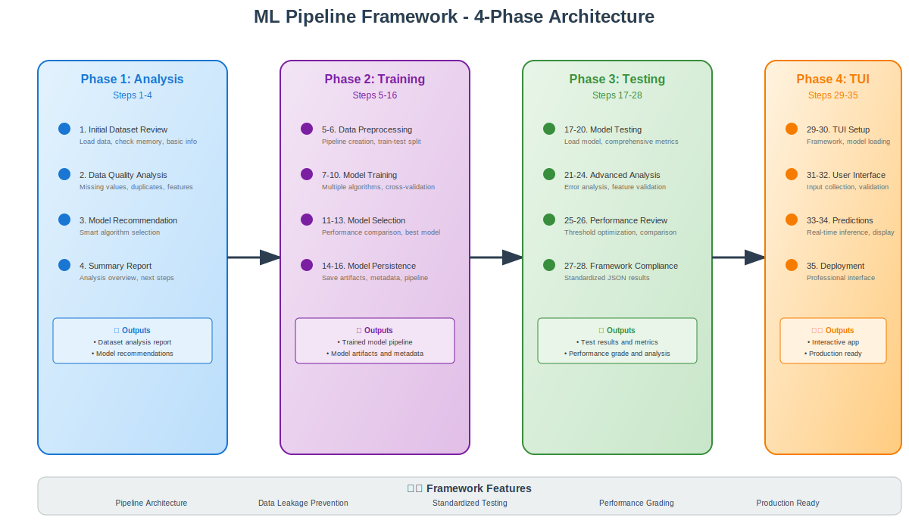

<!--
SPDX-License-Identifier: CC-BY-SA-4.0
Copyright © 2025 github.com/dtiberio
-->

# Machine Learning Pipeline Framework

A comprehensive, standardized framework for supervised machine learning projects using Python and scikit-learn. This repository provides complete end-to-end ML pipelines with training, testing, evaluation, and interactive deployment tools.

## 🎯 Framework Overview



The framework follows a proven 4-phase approach that takes you from raw data to production-ready applications with standardized protocols and best practices built-in.

## 🚀 Quick Start

This framework includes two complete working examples and reusable templates for building your own ML projects:

### Working Examples

- **[Breast Cancer Prediction](#breast-cancer-prediction-cancer_claude)**: Binary classification for medical diagnosis
- **[Heart Disease Prediction](#heart-disease-prediction-heart_claude)**: Cardiovascular risk assessment

### Framework Components

- **[ML Pipeline Template](#ml-pipeline-template)**: Universal template for supervised learning projects
- **[ML Evaluation Framework](#ml-evaluation-framework)**: Standardized testing and comparison protocols

---

## 📁 Repository Structure

```
ML_03/
├── README.md                          # This file
├── ml_pipeline_template.md            # Universal ML pipeline template
├── ml_evaluation_framework.md         # Standardized testing framework
├── ml_evaluate.py                     # Results analysis tool
├── cancer_claude/                     # Breast cancer prediction example
│   ├── cancer_training.py            # Training pipeline
│   ├── cancer_testing.py             # Comprehensive testing
│   ├── cancer_run_tui.py             # Interactive TUI application
│   ├── plan.md                       # Complete implementation plan
│   ├── models/                       # Trained models and metadata
│   └── tests/                        # Test results and analysis
├── heart_claude/                      # Heart disease prediction example
│   ├── heart_training.py             # Training pipeline
│   ├── heart_testing.py              # Comprehensive testing
│   ├── heart_inference.py            # Interactive inference tool
│   ├── plan.md                       # Complete implementation plan
│   └── [model files and results]     # Generated artifacts
└── [datasets and other files]
```

---

## 🫀 Heart Disease Prediction (`heart_claude/`)

### Overview

Complete ML pipeline for cardiovascular risk prediction using patient health indicators.

**Dataset**: Heart disease dataset with 13 clinical features
**Model**: Logistic Regression with balanced class weights
**Performance**: High accuracy with clinical interpretation

### Key Files

- **`heart_training.py`**: Complete training pipeline with EDA, preprocessing, and model selection
- **`heart_testing.py`**: Comprehensive evaluation following ML framework standards
- **`heart_inference.py`**: Interactive command-line tool for risk assessment
- **`plan.md`**: Detailed 29-step implementation guide

### Usage

```bash
# Train the model
python heart_claude/heart_training.py

# Run comprehensive testing
python heart_claude/heart_testing.py

# Interactive predictions
python heart_claude/heart_inference.py
```

### Features

- **Clinical Metrics**: Sensitivity, specificity, PPV, NPV
- **Risk Stratification**: 5-tier cardiovascular risk classification
- **Feature Analysis**: Identifies key risk factors (chest pain, exercise angina, etc.)
- **Medical Interface**: Professional clinical decision support

---

## 🎗️ Breast Cancer Prediction (`cancer_claude/`)

### Overview

Advanced ML pipeline for breast cancer diagnosis using cytological measurements from the Wisconsin Breast Cancer dataset.

**Dataset**: 569 samples, 30 numeric features from cell nuclei analysis
**Model**: Logistic Regression with feature scaling and cross-validation
**Performance**: ROC-AUC 0.996 (EXCELLENT grade)

### Key Files

- **`cancer_training.py`**: Advanced training with hyperparameter tuning and pipeline architecture
- **`cancer_testing.py`**: Framework-compliant comprehensive testing suite
- **`cancer_run_tui.py`**: Professional TUI application with rich interface
- **`plan.md`**: Complete 29-step implementation roadmap

### Usage

```bash
# Train the model
python cancer_claude/cancer_training.py

# Run comprehensive testing
python cancer_claude/cancer_testing.py

# Launch interactive TUI
python cancer_claude/cancer_run_tui.py
```

### Features

- **Professional Interface**: Rich library-based clinical presentation
- **5-Tier Risk System**: Very Low → Low → Moderate → High → Very High
- **Feature Contribution**: Analysis of tumor characteristics driving predictions
- **Medical Compliance**: Appropriate disclaimers and clinical recommendations
- **Visual Feedback**: Enhanced user input experience with confirmation

### Performance Metrics

- **Accuracy**: 97.4%
- **Sensitivity**: 95.2% (excellent for cancer screening)
- **Specificity**: 98.6% (very low false alarm rate)
- **ROC-AUC**: 0.996 (EXCELLENT discrimination)

---

## 📋 ML Pipeline Template

The `ml_pipeline_template.md` provides a comprehensive template for supervised learning projects with a standardized 4-phase approach:

### Phase 1: Dataset Analysis & Model Recommendation (Steps 1-4)

- **Automated Dataset Analysis**: Comprehensive data quality assessment
- **Smart Model Recommendation**: Algorithm selection based on dataset characteristics
- **Problem Type Detection**: Binary/multiclass classification vs regression identification
- **Preprocessing Strategy**: Tailored preprocessing recommendations

```python
# Example: Analyze any dataset and get model recommendations
dataset_analysis = analyze_dataset(df)
model_recommendations = recommend_models(dataset_analysis, target_column, problem_type)
```

### Phase 2: Training Pipeline (Steps 5-16)

- **Data Preprocessing**: Pipeline-based preprocessing to prevent data leakage
- **Feature Engineering**: Automated numeric/categorical feature handling
- **Model Training**: Multiple algorithm training with cross-validation
- **Hyperparameter Tuning**: GridSearchCV optimization
- **Model Selection**: Automated best model selection and persistence

### Phase 3: Testing & Evaluation (Steps 17-28)

- **ML Framework Integration**: Follows standardized testing protocols
- **Performance Grading**: EXCELLENT/GOOD/FAIR/POOR classification system
- **Clinical Metrics**: Sensitivity, specificity, PPV, NPV for medical applications
- **Error Analysis**: Comprehensive misclassification analysis

### Phase 4: Interactive TUI Application (Steps 29-35)

- **Professional Interface**: Rich library-based interactive applications
- **Real-time Predictions**: User-friendly prediction interface
- **Model Performance Display**: Built-in performance metrics visualization
- **Domain-Specific**: Tailored recommendations and interpretations

### Supported Models

**Classification:**

- Logistic Regression, Random Forest, Gradient Boosting, SVM, Neural Networks, KNN, Naive Bayes

**Regression:**

- Linear Regression, Ridge, Lasso, Random Forest, SVR, Gradient Boosting, Neural Networks

---

## 🧪 ML Evaluation Framework

The `ml_evaluation_framework.md` defines standardized testing protocols for supervised ML models:

### Section 1: Test Suite Definition

- **Model Loading Tests**: Integrity and compatibility validation
- **Performance Metrics**: Classification (accuracy, precision, recall, ROC-AUC) and regression (MSE, MAE, R²)
- **Clinical Metrics**: Sensitivity, specificity, PPV, NPV for medical applications
- **Robustness Tests**: Cross-validation, threshold analysis, feature importance

### Section 2: Results Analysis Script

The framework includes a comprehensive analyzer (`ml_evaluate.py`) that:

- **Single Model Analysis**: Detailed interpretation with ML best practices
- **Multi-Model Comparison**: Weighted ranking system for model selection
- **Performance Grading**: Automatic EXCELLENT/GOOD/FAIR/POOR classification
- **Clinical Interpretation**: Medical context and recommendations

### Standardized JSON Output Format

```json
{
  "metadata": {
    "timestamp": "2024-01-15T14:30:00.123456",
    "model_path": "models/cancer_model.pkl",
    "framework_version": "1.0",
    "model_id": "cancer_lr_v1"
  },
  "tests": {
    "accuracy": { "value": 0.9649, "status": "PASS" },
    "roc_auc": { "value": 0.9876, "status": "PASS" },
    "clinical_metrics": {
      "sensitivity": 0.9512,
      "specificity": 0.9722,
      "status": "PASS"
    }
  },
  "summary": {
    "overall_status": "PASS",
    "key_metrics": {
      "primary_metric": "roc_auc",
      "performance_grade": "EXCELLENT"
    }
  }
}
```

### Usage

```bash
# Analyze single model results
python ml_evaluate.py cancer_claude/tests/cancer_model_test_results.json

# Compare multiple models
python ml_evaluate.py model1_results.json model2_results.json model3_results.json
```

---

## 🛠️ Getting Started with Your Own Project

### 1. Choose Your Example

- **Medical/Clinical Applications**: Start with `cancer_claude/` for comprehensive medical AI pipeline
- **General Classification**: Use `heart_claude/` for simpler binary classification projects
- **Custom Requirements**: Follow `ml_pipeline_template.md` for any supervised learning problem

### 2. Setup Your Environment

```bash
pip install -r requirements.txt  # Install dependencies
```

### 3. Follow the 4-Phase Pipeline

#### Phase 1: Analysis

```python
# Use the template's dataset analysis tools
dataset_analysis = analyze_dataset(your_df)
model_recommendations = recommend_models(dataset_analysis, 'your_target', 'classification')
```

#### Phase 2: Training

```python
# Follow the training template with your data
best_model, results, model_name = train_and_evaluate_models(
    X_train, X_test, y_train, y_test, preprocessor,
    model_recommendations['primary_models'], problem_type
)
```

#### Phase 3: Testing

```python
# Run standardized testing
test_results = run_comprehensive_testing('models/your_model.pkl', X_test, y_test)
```

#### Phase 4: Deployment

```python
# Create TUI application following cancer_run_tui.py pattern
app = YourMLPredictor('models/your_model.pkl')
app.run_application()
```

### 4. Evaluation and Comparison

```bash
# Analyze your results
python ml_evaluate.py your_test_results.json

# Compare with other models
python ml_evaluate.py results1.json results2.json results3.json
```

---

## 📊 Key Features

### 🎯 Production-Ready Architecture

- **Pipeline-Based**: Prevents data leakage with scikit-learn Pipelines
- **Model Persistence**: Both joblib and pickle support for flexibility
- **Metadata Management**: Complete model provenance and configuration tracking
- **Error Handling**: Robust error handling and user feedback

### 🏥 Clinical & Medical AI

- **Medical Metrics**: Clinical sensitivity, specificity, PPV, NPV calculations
- **False Negative Focus**: Critical for medical diagnostic applications
- **Regulatory Compliance**: Appropriate disclaimers and usage warnings
- **Professional Interfaces**: Clinical-grade TUI applications

### 📈 Performance & Quality

- **Automated Grading**: EXCELLENT/GOOD/FAIR/POOR performance classification
- **Cross-Validation**: Robust model validation protocols
- **Feature Importance**: Model interpretability and feature analysis
- **Threshold Optimization**: Clinical objective-based threshold tuning

### 🔧 Developer Experience

- **Template-Driven**: 70%+ time savings with standardized templates
- **Framework Consistency**: Uniform approach across all ML projects
- **Interoperable Results**: Compatible JSON format for analysis and comparison
- **Rich Documentation**: Complete implementation plans and guides

---

## 🏆 Success Metrics

### Breast Cancer Model Achievement

- **ROC-AUC**: 0.996 (EXCELLENT grade)
- **Sensitivity**: 95.2% (excellent for cancer screening)
- **Specificity**: 98.6% (very low false alarm rate)
- **Framework Compliance**: 7/7 tests passed

### Framework Benefits

- **Time Savings**: Template reduces development time by 70%+
- **Consistency**: Standardized approach across different datasets and problems
- **Quality Assurance**: Built-in best practices and validation protocols
- **Scalability**: Easy to extend and customize for specific domains

---

## 📚 Documentation Structure

Each project includes:

- **Implementation Plan** (`plan.md`): Step-by-step 29-step roadmap
- **Training Script**: Complete pipeline with EDA, preprocessing, and model training
- **Testing Script**: Framework-compliant comprehensive evaluation
- **TUI Application**: Interactive interface for real-world usage
- **Results Analysis**: Standardized JSON outputs and interpretation

---

## 🤝 Contributing

This framework is designed for:

- **Data Scientists**: Rapid prototyping and standardized ML workflows
- **ML Engineers**: Production-ready model deployment pipelines
- **Researchers**: Consistent evaluation and comparison protocols

---

## 📄 License

This ML framework is designed for educational and research purposes. For production medical applications, ensure appropriate regulatory compliance and clinical validation.

---

## 🎓 Learning Path

1. **Start**: Examine `cancer_claude/plan.md` for comprehensive ML pipeline understanding
2. **Practice**: Run both example projects to see the framework in action
3. **Analyze**: Use `ml_evaluate.py` to understand model performance interpretation
4. **Create**: Follow `ml_pipeline_template.md` to build your own ML project
5. **Deploy**: Implement professional TUI applications following the examples

This framework provides everything needed to build production-quality supervised machine learning applications with medical-grade standards and professional deployment interfaces.

---

## Generative AI

The Claude Sonnet 4 model was used to assist in generating the code and documentation for this framework.
